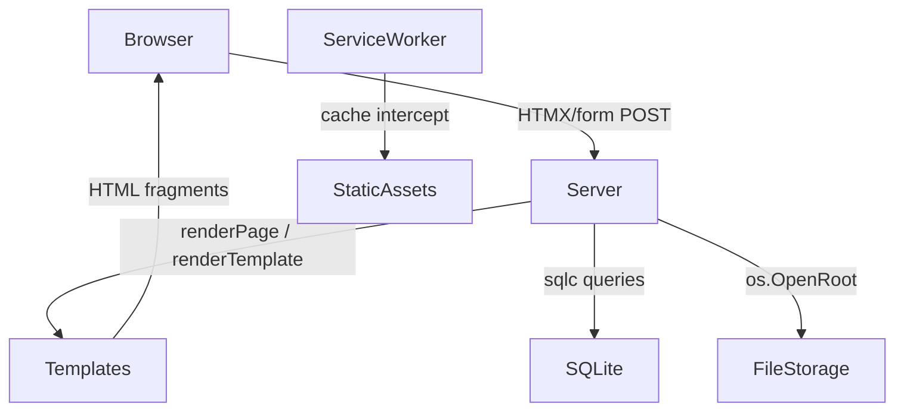

# Design Document: App Feature Roadmap

## Overview

This document covers the technical design for ten features across the Go-based diary and symptoms tracker. The features span from near-term UX improvements (onboarding, alert banners, image upload, service worker) to strategic capabilities (vector search, cluster visualization, suggested trackables, secure share links). All features build on the existing architecture: SQLite + sqlc-generated queries, HTMX-driven frontend, WebAuthn authentication, goose migrations, and the `func (s *Server) handler(w, r)` handler pattern.

The design is ordered by implementation priority. Strategic features (Requirements 7–9) are designed for future implementation and intentionally leave provider/algorithm choices configurable.

---

## Architecture

The app follows a server-rendered architecture with HTMX for partial page updates. Key constraints that shape every feature:

- **No manual edits to `internal/db/`** — all DB changes go through `db/schema.sql` + `db/queries.sql` → `sqlc generate`
- **HTMX contract** — the server must return a success response before the client removes or replaces DOM nodes
- **`os.OpenRoot` for file writes** — directory confinement for all file storage
- **Settings table** — per-user key/value store used for persistent preferences and flags
- **Goose migrations** — numbered SQL files in `db/migrations/`, applied at startup before HTTP listener starts




---

## Components and Interfaces

### Requirement 1 & 2: Multi-Step Onboarding Flow

**New routes:**
```
GET  /onboarding              → redirect to /onboarding/1
GET  /onboarding/{step}       → render step page (steps 1–5)
POST /onboarding/{step}       → process step, redirect to next or /
POST /onboarding/{step}/skip  → skip step, redirect to next or /
```

**Middleware change:** `withSessionRequired` is extended to check `onboarding_complete` on the home route (`/`). If the setting is absent or not `"1"`, redirect to `/onboarding/1`. Onboarding routes are added to `isPublicRoute` only for authenticated users — they require a session but bypass the onboarding check itself.

**Handler:** `internal/server/onboarding.go`
```go
func (s *Server) onboardingStep(w http.ResponseWriter, r *http.Request)
func (s *Server) onboardingStepPost(w http.ResponseWriter, r *http.Request)
```

**Step definitions** (compile-time slice, not DB-driven):
```go
type onboardingStep struct {
    Number      int
    TemplateKey string   // e.g. "onboarding_passkey"
    TitleKey    string   // i18n key
    ImageDesc   string   // alt text / image description for the step illustration
}
```

Step 1 — Passkey explainer: explains passkeys are device-bound, more secure than passwords, and that the app assumes one device but supports adding more via the device-link flow.
Step 2 — Language selection: renders the same language `<select>` as settings; on POST, calls `saveUserSettings`.
Step 3 — Trackable setup: renders `trackablePresetList` partial; user can add one or more presets inline via existing HTMX trackable endpoints.
Step 4 — Audio introduction: explains voice recording, transcription, and what happens after submission.
Step 5 — Navigation explanation: explains the difference between the Trackables list page and adding a trackable value to an entry.

**Completion:** On POST to step 5 (or skip), the handler calls `UpsertSetting` with key `onboarding_complete`, value `"1"`, then redirects to `/`.

**Auth page hook:** A "How to get started" button on `/auth` links to `/onboarding/1` — this is a pre-auth informational path. Since the user is not yet authenticated, this renders a read-only preview of step 1 without requiring a session. A separate public route `/onboarding/preview` serves this.

**Image descriptions for each step** (used as `alt` text and as prompts for future illustration assets):
1. Passkey explainer: "A smartphone with a fingerprint sensor glowing, next to a broken padlock representing a discarded password, on a calm blue background."
2. Language: "A globe with speech bubbles in different languages floating around it, soft pastel colors."
3. Trackables: "A simple checklist with colorful icons for fatigue, sleep, and mood, being ticked off one by one."
4. Audio: "A microphone with sound waves, and a small document appearing beside it to represent transcription."
5. Navigation: "Two paths diverging — one leading to a list view, one leading to a diary entry form — with clear signpost labels."

---

### Requirement 3: Versioned Home Page Alert Banner

**Alert configuration** is a compile-time constant (or embedded config value) in `internal/server/constants.go`:
```go
const (
    activeAlertVersion = "2025-07-01"          // empty string = no active alert
    activeAlertI18nKey = "alert.2025_07_01"    // i18n key for the message
)
```

Changing the version string in a release activates a new alert for all users who haven't dismissed it.

**New route:**
```
POST /alert/{version}/dismiss  → record dismissal, return 200 + empty fragment
```

**Handler:** `internal/server/home.go` — `home` handler reads `alert_dismissed_{version}` from settings. If `activeAlertVersion != ""` and the setting is absent, it passes `Alert` data to the template.

**Dismissal storage:** Uses the existing `settings` table with key `alert_dismissed_{version}` = `"1"`. No new table needed.

**HTMX contract:** The dismiss button sends `hx-post="/alert/{version}/dismiss"` with `hx-target="#alert-banner"` and `hx-swap="outerHTML"`. The server returns `200 OK` with an empty body (or a zero-height placeholder). The client replaces the banner only after the server confirms success.

---

### Requirement 4: Secure Image Upload

**New routes:**
```
POST /entry/{id}/images        → upload image, return HTMX fragment
DELETE /entry/{id}/images/{imgID} → delete image
```

**Handler:** `internal/server/images.go`
```go
func (s *Server) uploadEntryImage(w http.ResponseWriter, r *http.Request)
func (s *Server) deleteEntryImage(w http.ResponseWriter, r *http.Request)
```

**Client-side resize:** A small JS module (`web/static/image-upload.js`) uses the Canvas API to resize images client-side before upload if they exceed 2 MB. This is a best-effort UX improvement; the server enforces the 2 MB limit independently.

**Storage:** Images stored in `data/images/{userID}_{timestamp}.{ext}` using `os.OpenRoot(cfg.ImageStorageDir)`. Config adds:
```go
ImageStorageDir string  // default: "data/images"
```

**Filename pattern:** `{userID}_{unixNano}.{ext}` — never uses the user-supplied filename.

**New DB table** (added to `db/schema.sql` and a new goose migration):
```sql
CREATE TABLE IF NOT EXISTS entry_images (
    id              INTEGER PRIMARY KEY AUTOINCREMENT,
    entry_id        INTEGER NOT NULL,
    user_id         INTEGER NOT NULL,
    file_path       TEXT NOT NULL,
    mime_type       TEXT NOT NULL,
    original_size   INTEGER NOT NULL,
    created_at_utc  INTEGER NOT NULL,
    FOREIGN KEY (entry_id) REFERENCES entries(id) ON DELETE CASCADE,
    FOREIGN KEY (user_id)  REFERENCES users(id)   ON DELETE CASCADE
);
CREATE INDEX IF NOT EXISTS idx_entry_images_entry ON entry_images(entry_id);
CREATE INDEX IF NOT EXISTS idx_entry_images_user  ON entry_images(user_id);
```

**Storage tier tracking** (future-proofing): A `storage_tier` column (`TEXT DEFAULT 'local'`) is included in `entry_images` from the start. Values: `'local'`, `'object'`. This allows a future migration to object storage without a schema change.

**Cascade delete:** The `ON DELETE CASCADE` on `entry_id` handles metadata cleanup. The `deleteEntry` handler is extended to also delete image files from disk before the DB delete.

**Allowed MIME types:** `image/jpeg`, `image/png`, `image/webp`, `image/gif`.

---

### Requirement 5: Safe Database Schema Upgrade

No new runtime code. This requirement defines a **developer discipline** enforced by process:

1. Every new migration file in `db/migrations/` must be tested against a fresh DB (`go test ./... -run TestMigrations`) before commit.
2. A snapshot of the production schema (exported via `.dump` or `sqlite3 app.db .schema`) is kept in `db/snapshots/` and new migrations are verified against it locally.
3. Destructive migrations (column removal, table drop) must include a SQL comment: `-- DESTRUCTIVE: reason and backup confirmation`.
4. The existing `runMigrations` in `internal/server/migrations.go` already exits with a fatal log on failure, satisfying requirement 5.4.

A `TestMigrationsFreshDB` test in `internal/server/migrations_test.go` applies all migrations to an in-memory SQLite DB and verifies the final schema matches `db/schema.sql`.

---

### Requirement 6: Service Worker with Static Asset Caching

**New files:**
- `web/static/sw.js` — the service worker script
- `web/static/sw-assets.js` — generated asset manifest (or inlined as a JS constant)

**Registration:** Added to `internal/views/layout.html`:
```html
<script>
  if ('serviceWorker' in navigator) {
    navigator.serviceWorker.register('/static/sw.js', { scope: '/' });
  }
</script>
```

**Cache strategy:**
- Cache name includes a version string: `CACHE_NAME = 'static-v{BUILD_VERSION}'`
- On `install`: pre-cache all `/static/` assets listed in the manifest
- On `activate`: delete all caches whose name doesn't match `CACHE_NAME`
- On `fetch`: cache-first for `/static/` requests; network-pass-through for everything else (HTML, API, audio, images)

**No push notifications:** The service worker contains no `Notification.requestPermission()` call and no `push` event listener.

**Build version:** The version string is injected at build time via a Go template variable or a simple `sed` step in the build script. In dev mode, the version is `"dev"` so caching is effectively disabled (each reload gets a new cache name).

---

### Requirement 7: Vector Semantic Search (Strategic)

**New DB tables:**
```sql
CREATE TABLE IF NOT EXISTS entry_embeddings (
    id              INTEGER PRIMARY KEY AUTOINCREMENT,
    entry_id        INTEGER NOT NULL UNIQUE,
    user_id         INTEGER NOT NULL,
    model_name      TEXT NOT NULL,
    model_version   TEXT NOT NULL,
    embedding       BLOB NOT NULL,  -- float32 array, little-endian
    created_at_utc  INTEGER NOT NULL,
    updated_at_utc  INTEGER,
    FOREIGN KEY (entry_id) REFERENCES entries(id) ON DELETE CASCADE,
    FOREIGN KEY (user_id)  REFERENCES users(id)   ON DELETE CASCADE
);
```

**Embedding provider interface:**
```go
// internal/embeddings/provider.go
type Provider interface {
    Embed(ctx context.Context, text string) ([]float32, error)
    ModelName() string
    ModelVersion() string
}
```

Implementations: `LocalProvider` (calls a local binary/HTTP endpoint), `OpenAIProvider` (calls OpenAI embeddings API with explicit user consent gate). Selected via `EMBEDDING_PROVIDER` env var (`"local"` or `"openai"`). Default is `"local"` (disabled/no-op until configured).

**Search handler:**
```
GET /search?q={query}  → returns ranked entry list
```

Cosine similarity computed in Go over the stored float32 blobs. For SQLite at this scale (single user, hundreds of entries), in-process computation is sufficient.

**Fallback:** If the provider returns an error, the handler falls back to SQLite FTS5 full-text search and sets an `X-Search-Mode: fulltext` response header.

**Consent gate:** If `EMBEDDING_PROVIDER=openai`, the handler checks for a `settings` key `embedding_consent=1` before sending content to the external API. If absent, it falls back to full-text search and prompts the user to enable semantic search in settings.

---

### Requirement 8: Vector Cluster Visualization (Strategic)

**New route:**
```
GET /entries/clusters  → renders cluster map page (requires >= 20 embeddings)
```

**Dimensionality reduction:** A Go UMAP implementation (e.g. `github.com/nicholasgasior/gousmap` or a vendored implementation) reduces embeddings to 2D. t-SNE is the fallback if UMAP is unavailable. The algorithm is selected via `CLUSTER_ALGORITHM` env var (`"umap"` or `"tsne"`).

**Rendering:** The 2D coordinates are passed to the template as a JSON array and rendered client-side using a lightweight SVG scatter plot (no external charting library dependency). Each point is colored by the dominant trackable category of the entry.

**Threshold:** The handler checks `COUNT(*)` in `entry_embeddings` for the user. If < 20, it renders a "need more entries" message instead of the map.

---

### Requirement 9: Suggested Trackables from Vectors (Strategic)

**New route:**
```
GET  /trackables/suggestions          → returns up to 5 suggestions
POST /trackables/suggestions/{id}/accept  → add trackable (delegates to existing add flow)
POST /trackables/suggestions/{id}/dismiss → record dismissal for 30 days
```

**New DB table:**
```sql
CREATE TABLE IF NOT EXISTS trackable_suggestion_dismissals (
    id                   INTEGER PRIMARY KEY AUTOINCREMENT,
    user_id              INTEGER NOT NULL,
    template_id          INTEGER NOT NULL,
    dismissed_until_utc  INTEGER NOT NULL,
    created_at_utc       INTEGER NOT NULL,
    FOREIGN KEY (user_id)     REFERENCES users(id) ON DELETE CASCADE,
    FOREIGN KEY (template_id) REFERENCES trackable_templates(id) ON DELETE CASCADE,
    UNIQUE(user_id, template_id)
);
```

**Suggestion logic:** Compute cosine similarity between the user's entry embeddings (centroid) and each trackable template's description embedding. Return the top 5 templates the user hasn't already added and hasn't dismissed within 30 days.

**Quality gate:** If mean intra-cluster cosine similarity < `SUGGESTION_QUALITY_THRESHOLD` (default `0.3`), suppress suggestions and log a warning.

---

### Requirement 10: Secure Share Links

**New routes:**
```
POST /share/create              → generate token+password, return confirmation page
GET  /share/{token}             → password entry form (public, no session required)
POST /share/{token}             → submit password, render report or 401
GET  /share/{token}/print       → print-friendly version (same auth gate)
DELETE /share/{token}           → revoke token (authenticated user only)
GET  /settings/shares           → list active tokens for current user
```

**New DB table:**
```sql
CREATE TABLE IF NOT EXISTS share_tokens (
    id               INTEGER PRIMARY KEY AUTOINCREMENT,
    user_id          INTEGER NOT NULL,
    token_hash       BLOB NOT NULL UNIQUE,   -- SHA-256 of the raw token
    password_hash    BLOB NOT NULL,          -- bcrypt of the short password
    scope_date_from  TEXT,                   -- YYYY-MM-DD, NULL = no lower bound
    scope_date_to    TEXT,                   -- YYYY-MM-DD, NULL = no upper bound
    scope_private    INTEGER NOT NULL DEFAULT 0,  -- 1 = include private entries
    expires_at_utc   INTEGER NOT NULL,
    accessed_at_utc  INTEGER,                -- set on first successful use (invalidates token)
    revoked_at_utc   INTEGER,
    created_at_utc   INTEGER NOT NULL,
    FOREIGN KEY (user_id) REFERENCES users(id) ON DELETE CASCADE
);
CREATE INDEX IF NOT EXISTS idx_share_tokens_user    ON share_tokens(user_id);
CREATE INDEX IF NOT EXISTS idx_share_tokens_expires ON share_tokens(expires_at_utc);
```

**Token generation:**
- Raw token: 20 bytes from `crypto/rand` → base64url encoded (27 chars, ~160 bits entropy)
- Password: 7 chars from `[A-Z2-9]` (excludes ambiguous chars 0/O/1/I) from `crypto/rand`
- Token stored as `SHA-256(rawToken)` (fast lookup, no need for bcrypt)
- Password stored as `bcrypt(password, cost=12)`

**One-time use:** On successful password verification, `accessed_at_utc` is set in the same transaction that renders the report. Subsequent requests with the same token hash find `accessed_at_utc IS NOT NULL` and return 404.

**Security headers** on all `/share/` routes:
```
X-Robots-Tag: noindex
Referrer-Policy: no-referrer
Cache-Control: no-store
```

**Cleanup:** A background goroutine (started in `server.New`) runs every 5 minutes and deletes rows where `expires_at_utc < now OR accessed_at_utc IS NOT NULL OR revoked_at_utc IS NOT NULL`.

**Print stylesheet:** A `<link rel="stylesheet" media="print" href="/static/share-print.css">` is included in the share report template.

**QR code:** Generated server-side using `github.com/skip2/go-qrcode` and embedded as a base64 PNG in the confirmation page. The QR encodes only the `/share/{token}` URL — the password is displayed as plain text alongside it.


---

## Data Models

### New / Modified Tables Summary

| Table | Purpose | New? |
|---|---|---|
| `settings` | Stores `onboarding_complete`, `alert_dismissed_{v}`, `embedding_consent` | Existing |
| `entry_images` | Image metadata per entry | New |
| `entry_embeddings` | Semantic embedding vectors per entry | New (strategic) |
| `trackable_suggestion_dismissals` | Per-user per-template suggestion cooldowns | New (strategic) |
| `share_tokens` | Hashed share tokens with scope and expiry | New |

### Settings Keys (Additions)

| Key | Value | Description |
|---|---|---|
| `onboarding_complete` | `"1"` | Set when user finishes or skips all onboarding steps |
| `alert_dismissed_{version}` | `"1"` | Set when user dismisses a specific alert version |
| `embedding_consent` | `"1"` | Set when user consents to external embedding API |

### `entry_images` Full Schema

```sql
CREATE TABLE IF NOT EXISTS entry_images (
    id              INTEGER PRIMARY KEY AUTOINCREMENT,
    entry_id        INTEGER NOT NULL,
    user_id         INTEGER NOT NULL,
    file_path       TEXT NOT NULL,
    mime_type       TEXT NOT NULL,
    original_size   INTEGER NOT NULL,
    storage_tier    TEXT NOT NULL DEFAULT 'local',
    created_at_utc  INTEGER NOT NULL,
    FOREIGN KEY (entry_id) REFERENCES entries(id) ON DELETE CASCADE,
    FOREIGN KEY (user_id)  REFERENCES users(id)   ON DELETE CASCADE,
    CHECK (mime_type IN ('image/jpeg','image/png','image/webp','image/gif')),
    CHECK (storage_tier IN ('local','object'))
);
```

### `share_tokens` Full Schema

See Components section above.

### Migration Sequence

New migrations to add (continuing from `00008`):
- `00009_entry_images.sql` — adds `entry_images` table
- `00010_share_tokens.sql` — adds `share_tokens` table
- `00011_entry_embeddings.sql` — adds `entry_embeddings` table (strategic, can be deferred)
- `00012_trackable_suggestion_dismissals.sql` — adds suggestion dismissals table (strategic)

Each migration file follows the goose format:
```sql
-- +goose Up
-- +goose StatementBegin
CREATE TABLE IF NOT EXISTS ...;
-- +goose StatementEnd

-- +goose Down
-- +goose StatementBegin
DROP TABLE IF EXISTS ...;
-- +goose StatementEnd
```

---

## Correctness Properties

*A property is a characteristic or behavior that should hold true across all valid executions of a system — essentially, a formal statement about what the system should do. Properties serve as the bridge between human-readable specifications and machine-verifiable correctness guarantees.*

### Property 1: Onboarding redirect invariant

*For any* authenticated user, the home route (`/`) should redirect to `/onboarding/1` if and only if the `onboarding_complete` setting is absent or not equal to `"1"` for that user.

**Validates: Requirements 1.1, 1.9, 2.2**

---

### Property 2: Onboarding completion persistence

*For any* user who completes or skips all five onboarding steps, querying the `settings` table for that user should return a row with `settings_key = 'onboarding_complete'` and `settings_value = '1'`.

**Validates: Requirements 1.8, 2.1**

---

### Property 3: Onboarding skip advances step

*For any* step index N in [1, 4], submitting a skip action to `/onboarding/N/skip` should result in a redirect to `/onboarding/{N+1}`. Skipping step 5 should redirect to `/`.

**Validates: Requirements 1.11**

---

### Property 4: Alert banner visibility

*For any* user and any active alert version, the home page response should contain the alert banner HTML if and only if the user does not have a `settings` row with key `alert_dismissed_{version}` = `"1"`.

**Validates: Requirements 3.1, 3.4, 3.6**

---

### Property 5: Alert dismissal persistence

*For any* user and any alert version, after a successful POST to `/alert/{version}/dismiss`, querying the `settings` table for that user should return a row with key `alert_dismissed_{version}` = `"1"`.

**Validates: Requirements 3.2**

---

### Property 6: Alert version isolation

*For any* two distinct alert versions A and B, dismissing version A should not create or modify a `settings` row for version B for any user.

**Validates: Requirements 3.5**

---

### Property 7: Image size enforcement

*For any* multipart upload where the image file size exceeds 2,097,152 bytes (2 MB), the server should return HTTP 400. For any upload where the file size is within the limit and the MIME type is allowed, the server should return HTTP 200.

**Validates: Requirements 4.2, 4.4**

---

### Property 8: Image MIME type enforcement

*For any* multipart upload with a `Content-Type` not in `{image/jpeg, image/png, image/webp, image/gif}`, the server should return HTTP 400. For any upload with an allowed MIME type and valid size, the server should return HTTP 200.

**Validates: Requirements 4.3, 4.5**

---

### Property 9: Image filename safety

*For any* image upload, the filename stored in `entry_images.file_path` should match the pattern `{userID}_{unixNano}.{ext}` and should not contain any substring from the user-supplied filename.

**Validates: Requirements 4.6**

---

### Property 10: Image metadata persistence

*For any* successful image upload for entry E by user U, querying `entry_images` should return exactly one row with `entry_id = E`, `user_id = U`, and a non-empty `file_path` and `mime_type`.

**Validates: Requirements 4.7, 4.8**

---

### Property 11: Image cascade delete

*For any* entry with N associated images, deleting the entry should result in zero rows in `entry_images` for that entry ID and zero image files on disk for that entry.

**Validates: Requirements 4.11**

---

### Property 12: Service worker asset pre-cache completeness

*For any* set of versioned static assets listed in the asset manifest, the service worker's install handler should include every asset URL in the pre-cache list.

**Validates: Requirements 6.2**

---

### Property 13: Service worker cache invalidation on version change

*For any* two distinct cache version strings V1 and V2, activating a service worker with version V2 should result in the deletion of all caches whose name contains V1.

**Validates: Requirements 6.4**

---

### Property 14: Service worker passthrough for non-static requests

*For any* request URL that does not begin with `/static/`, the service worker's fetch handler should not serve the response from cache and should pass the request to the network.

**Validates: Requirements 6.5**

---

### Property 15: Embedding stored per entry

*For any* diary entry created or updated while the embedding provider is configured, querying `entry_embeddings` should return exactly one row with `entry_id` matching that entry, and the `embedding` blob should be non-empty.

**Validates: Requirements 7.1**

---

### Property 16: Search results ordered by cosine similarity

*For any* search query Q and any two entries A and B returned in the results, if A appears before B in the result list then `cosine_similarity(embed(Q), embed(A)) >= cosine_similarity(embed(Q), embed(B))`.

**Validates: Requirements 7.2**

---

### Property 17: Embedding model metadata stored

*For any* row in `entry_embeddings`, the `model_name` and `model_version` fields should both be non-empty strings.

**Validates: Requirements 7.7**

---

### Property 18: Cluster map threshold

*For any* user with fewer than 20 rows in `entry_embeddings`, the `/entries/clusters` endpoint should not return a cluster map and should instead return a message indicating more entries are needed. For any user with 20 or more embeddings, the endpoint should return a cluster map.

**Validates: Requirements 8.1, 8.5**

---

### Property 19: Cluster map 2D output

*For any* set of N embeddings passed to the dimensionality reduction function, the output should be exactly N points each with exactly 2 coordinates (x, y).

**Validates: Requirements 8.2**

---

### Property 20: Suggestion count and exclusion

*For any* user, the suggestions endpoint should return at most 5 trackable templates, and none of the returned templates should already exist in that user's `trackable_definitions` (with `deleted_at_utc IS NULL`).

**Validates: Requirements 9.2**

---

### Property 21: Suggestion dismissal cooldown

*For any* user and any template T, after dismissing T, querying suggestions within 30 days should not include T in the results.

**Validates: Requirements 9.4**

---

### Property 22: Share token entropy and password format

*For any* generated share token, the raw token should be at least 16 bytes (128 bits) of cryptographically random data, and the password should match the regex `[A-Z2-9]{6,8}`.

**Validates: Requirements 10.1**

---

### Property 23: Share token hashed storage

*For any* created share token, the `share_tokens` table row should not contain the plaintext token or plaintext password — only their respective hashes.

**Validates: Requirements 10.2**

---

### Property 24: Share token expiry

*For any* created share token, `expires_at_utc` should equal `created_at_utc + 1800` (30 minutes in seconds).

**Validates: Requirements 10.8**

---

### Property 25: Share token single-use

*For any* valid, unexpired share token T and correct password P, after one successful POST to `/share/{T}` with password P, any subsequent request to `/share/{T}` (with any password) should return HTTP 404.

**Validates: Requirements 10.10**

---

### Property 26: Expired token returns 404

*For any* share token whose `expires_at_utc` is in the past, a GET or POST request to `/share/{token}` should return HTTP 404 regardless of the password submitted.

**Validates: Requirements 10.12**

---

### Property 27: Wrong password returns 401

*For any* valid, unexpired share token and any password string that does not match the stored bcrypt hash, a POST to `/share/{token}` should return HTTP 401.

**Validates: Requirements 10.14**

---

### Property 28: Share page security headers

*For any* response from any `/share/` route, the response headers should include `X-Robots-Tag: noindex` and `Referrer-Policy: no-referrer`.

**Validates: Requirements 10.15, 10.16**

---

## Error Handling

| Scenario | Behavior |
|---|---|
| Onboarding settings write fails | Log error, redirect to home (requirement 2.3) |
| Alert dismissal write fails | Return 500 to HTMX; banner remains visible |
| Image upload > 2 MB | Return 400 with descriptive message |
| Image MIME type disallowed | Return 400 with descriptive message |
| Image file saved but DB write fails | Delete file, return 500 |
| Entry delete with images — file delete fails | Log error, continue with DB delete (data integrity over orphan files) |
| Migration fails at startup | `log.Fatal` with migration filename, non-zero exit |
| Service worker install fails | Browser continues without caching (graceful degradation) |
| Embedding provider unavailable | Fall back to FTS5 full-text search, set `X-Search-Mode: fulltext` header |
| Embedding latency > 2000ms | Log warning, continue (do not fail the entry save) |
| Share token not found | Return 404, no information leakage |
| Share token expired | Return 404, no information leakage |
| Share password incorrect | Return 401, no information leakage about token existence |
| Share token cleanup goroutine error | Log error, retry on next interval (non-fatal) |

---

## Testing Strategy

### Dual Testing Approach

Both unit tests and property-based tests are required. Unit tests cover specific examples, integration points, and error conditions. Property-based tests verify universal invariants across randomized inputs.

### Unit Tests

- `TestOnboardingRedirectNewUser` — new user hits `/`, gets redirect to `/onboarding/1`
- `TestOnboardingRedirectCompletedUser` — user with `onboarding_complete=1` hits `/`, gets home page
- `TestOnboardingSkipAdvancesStep` — skip on step 3 redirects to step 4
- `TestAlertBannerRendered` — home page contains banner when alert active and not dismissed
- `TestAlertBannerHidden` — home page has no banner when dismissed
- `TestAlertDismissHTMX` — POST to dismiss returns 200 with empty body (not a redirect)
- `TestImageUploadTooLarge` — 3 MB upload returns 400
- `TestImageUploadBadMIME` — `text/plain` upload returns 400
- `TestImageUploadDBFailCleansFile` — inject DB error, verify file deleted
- `TestMigrationsFreshDB` — apply all migrations to in-memory SQLite, verify schema
- `TestShareTokenCreation` — token and password are hashed in DB
- `TestShareTokenExpiry` — expired token returns 404
- `TestShareTokenWrongPassword` — wrong password returns 401
- `TestShareTokenSingleUse` — second access returns 404
- `TestSharePageSecurityHeaders` — all `/share/` responses have required headers

### Property-Based Tests

Property-based testing library: **`pgregory.net/rapid`** (pure Go, no external dependencies, idiomatic for Go projects).

Each property test runs a minimum of **100 iterations**.

Tag format in comments: `// Feature: app-feature-roadmap, Property {N}: {property_text}`

```go
// Feature: app-feature-roadmap, Property 7: Image size enforcement
func TestProp_ImageSizeEnforcement(t *testing.T) {
    rapid.Check(t, func(t *rapid.T) {
        size := rapid.IntRange(2<<20+1, 10<<20).Draw(t, "size")
        // upload file of `size` bytes, assert 400
    })
}

// Feature: app-feature-roadmap, Property 8: Image MIME type enforcement
func TestProp_ImageMIMEEnforcement(t *testing.T) {
    rapid.Check(t, func(t *rapid.T) {
        mime := rapid.SampledFrom([]string{"text/plain","application/pdf","video/mp4","audio/webm"}).Draw(t, "mime")
        // upload with disallowed mime, assert 400
    })
}

// Feature: app-feature-roadmap, Property 22: Share token entropy and password format
func TestProp_ShareTokenFormat(t *testing.T) {
    rapid.Check(t, func(t *rapid.T) {
        // generate N tokens, assert each raw token >= 16 bytes
        // assert each password matches [A-Z2-9]{6,8}
    })
}

// Feature: app-feature-roadmap, Property 25: Share token single-use
func TestProp_ShareTokenSingleUse(t *testing.T) {
    rapid.Check(t, func(t *rapid.T) {
        // create token, use it once successfully
        // attempt second use, assert 404
    })
}

// Feature: app-feature-roadmap, Property 6: Alert version isolation
func TestProp_AlertVersionIsolation(t *testing.T) {
    rapid.Check(t, func(t *rapid.T) {
        vA := rapid.StringMatching(`[a-z0-9-]{5,20}`).Draw(t, "vA")
        vB := rapid.StringMatching(`[a-z0-9-]{5,20}`).Draw(t, "vB")
        rapid.Assume(vA != vB)
        // dismiss vA, assert no dismissal record for vB
    })
}

// Feature: app-feature-roadmap, Property 20: Suggestion count and exclusion
func TestProp_SuggestionCountAndExclusion(t *testing.T) {
    rapid.Check(t, func(t *rapid.T) {
        // generate random set of user trackables and embeddings
        // call suggestions, assert len <= 5 and no overlap with existing trackables
    })
}
```

Each correctness property listed in the Correctness Properties section must be implemented by exactly one property-based test.
